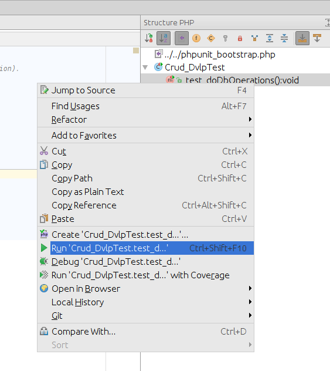

# Tests running in Magento v2 module

## Tests classification
  
There are 2 tests classes used in this sample module:

* Unit tests ([./test/unit](../test/unit/)): lightweight tests (without initialization of the Magento application);
* Functional tests ([./test/functional](../test/functional/)): testing some features in the Magento environment 
(these scripts can be launched from IDE to learn Magento aspects).

## Test modes

* Package: launch all tests from IDE/CLI.
* Development: launch single test class or method from IDE/CLI;

## Launch package tests

    $ cd ./work
    $ phpunit -c ./test/unit/phpunit.dist.xml
    $ phpunit -c ./test/functional/phpunit.dist.xml

## Launch development tests

I use PhpStorm. Setup Composer autoload function for PHPUnit in PhpStorm:

Go to `./work/htdocs/app/code/Flancer32/Sample/Test/Dvlp/Lib/` and start test class or method in 'run' or 'debug' mode 
(mouse right click then select action):

## Test Magento 2 itself

[Run tests](http://devdocs.magento.com/guides/v2.0/config-guide/cli/config-cli-subcommands-test.html)

    $ php ./bin/magento module:enable Magento_Developer
    $ php ./bin/magento dev:tests:run unit
    
    
    $ php ./bin/magento dev:tests:run --help
    Usage:
     dev:tests:run [type]
    
    Arguments:
     type                  Type of test to run. Available types: all, unit, integration, integration-all, static, static-all, integrity, legacy, default (default: "default")
    
    Options:
     --help (-h)           Display this help message
     --quiet (-q)          Do not output any message
     --verbose (-v|vv|vvv) Increase the verbosity of messages: 1 for normal output, 2 for more verbose output and 3 for debug
     --version (-V)        Display this application version
     --ansi                Force ANSI output
     --no-ansi             Disable ANSI output
     --no-interaction (-n) Do not ask any interactive question
