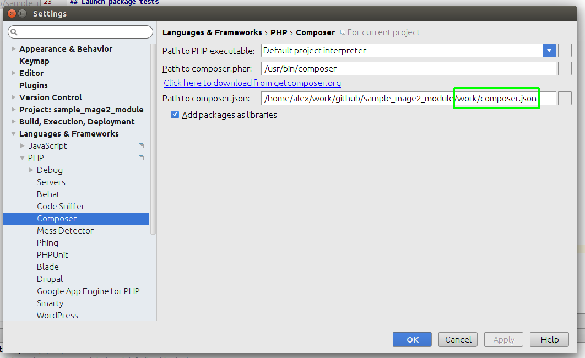

# Tests running in Magento v2 module

## Tests classification
  
There are 2 tests classes are used in this sample module:

* Unit tests ([./test/unit](../test/unit/)): lightweight tests (without initialization of the Magento application, all 
external classes are mocked);
* Functional tests ([./test/functional](../test/functional/)): testing some features in the Magento environment 
(these scripts can be launched from IDE to learn Magento aspects).

## Test modes

* Package: launch all application or module tests from IDE/CLI.
* Development: launch single test class or method from IDE/CLI;

## Launch package tests

* [Application level](./tests_run_app.md)
* [Module level](./tests_run_mod.md)

## Launch development tests

[Run/debug tests individually](./tests_run_indiv.md)

## PHPUnit location

It is possible to use system `phpunit` application:

    $ phpunit ...
    $ /usr/bin/phpunit ...
    
    
or use instance that is loaded by composer:

    $ cd ./work
    $ ./vendor/bin/phpunit ...
    

## Setup IDE PhpStorm

To launch test units from IDE setup composer autoloader in the settings (`./work/composer.json`, not `./composer.json`):
 
