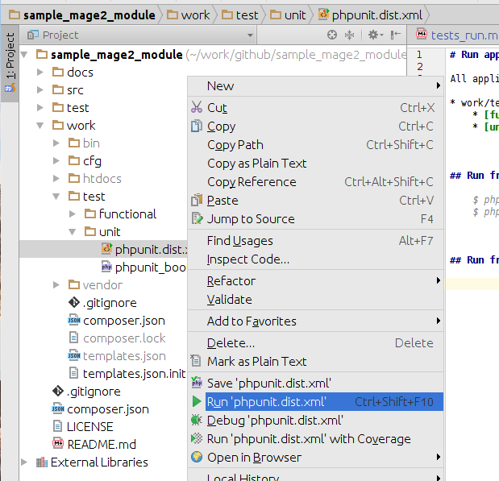

# Run application level tests in Magento v2 development environment

All application level tests are in `work/test` folder

* work/test
    * [functional](../work/test/functional/phpunit.dist.xml)
    * [unit](../work/test/unit/phpunit.dist.xml)

## Run from CLI

    $ phpunit -c ./work/test/functional/phpunit.dist.xml 
    $ phpunit -c ./work/test/unit/phpunit.dist.xml 
  
    
    
## Run from IDE PhpStorm

Right click on appropriate `phpunit.dist.xml` then select *Run 'phpunit.dist.xml'*:

