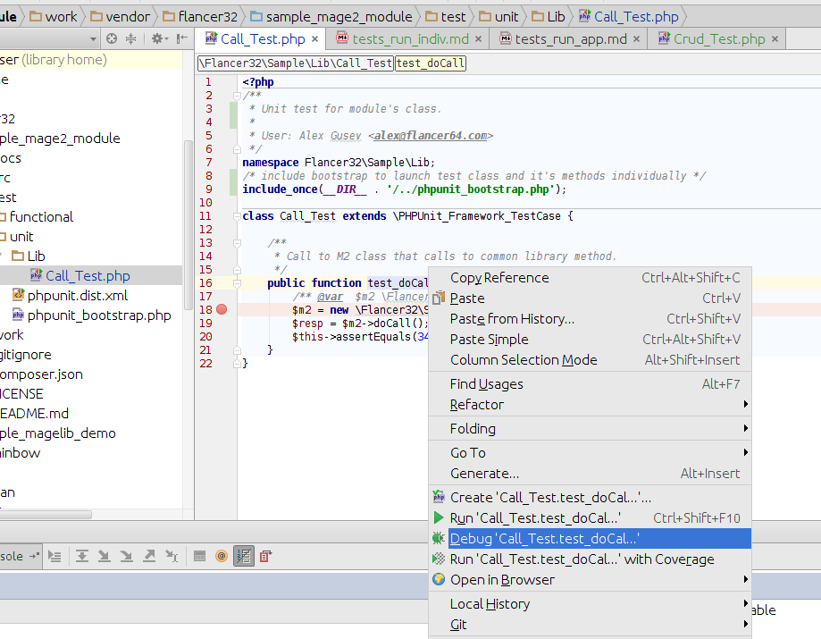

# Run/debug individual tests in Magento v2 development environment

There are 2 development modules in the sample. 
All module level tests are in `work/vendor/flancer32/<module_name>/test` folder:

* work/vendor/flancer32/sample_mage2_module/test
    * [functional](../work/vendor/flancer32/sample_mage2_module/test/functional/)
    * [unit](../work/vendor/flancer32/sample_mage2_module/test/unit/)
* work/vendor/flancer32/sample_magelib_demo/test
    * [functional](../work/vendor/flancer32/sample_magelib_demo/test/functional/)
    * [unit](../work/vendor/flancer32/sample_magelib_demo/test/unit/)

## Run one test class from CLI

To launch `Flancer32\Sample\Lib\Crud_Test` class 
from `./vendor/flancer32/sample_mage2_module/test/functional/Lib/Crud_Test.php` folder
do:

    $ cd ./work
    $ ./vendor/bin/phpunit --no-configuration Flancer32\Sample\Lib\Crud_Test ./vendor/flancer32/sample_mage2_module/test/functional/Lib/Crud_Test.php

## Run one test method from CLI

To launch `test_doDbOperations` method 
in `Flancer32\Sample\Lib\Crud_Test` class 
from `./work/vendor/flancer32/sample_mage2_module/test/functional/Lib/Crud_Test.php` script 
do: 

    $ cd ./work
    $ ./vendor/bin/phpunit --no-configuration --filter "/::test_doDbOperations( .*)?$/" Flancer32\Sample\Lib\Crud_Test ./vendor/flancer32/sample_mage2_module/test/functional/Lib/Crud_Test.php

    
    
## Run/debug one class/methods from IDE PhpStorm

Right click on class/method name in IDE then select Run/Debug option: 

    
