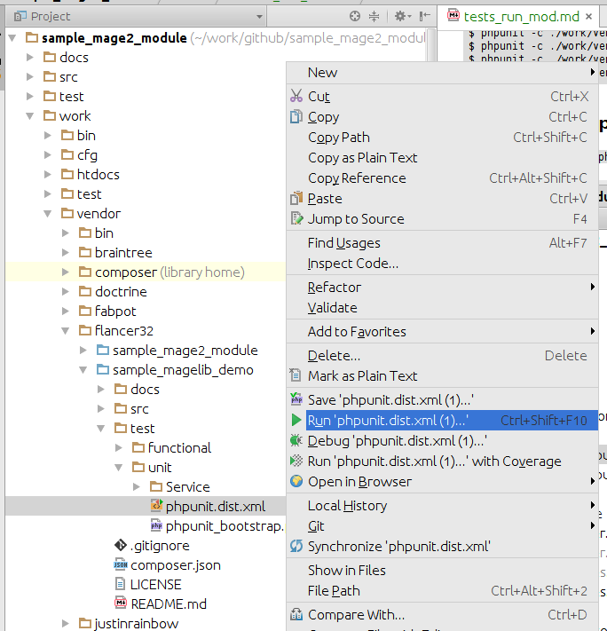

# Run module level tests in Magento v2 development environment

There are 2 development modules in the sample. 
All module level tests are in `work/vendor/flancer32/<module_name>/test` folder:

* work/vendor/flancer32/sample_mage2_module/test
    * [functional](../test/functional/phpunit.dist.xml)
    * [unit](..//test/unit/phpunit.dist.xml)
* work/vendor/flancer32/sample_magelib_demo/test
    * [functional](https://github.com/flancer32/sample_magelib_demo/blob/master/test/functional/phpunit.dist.xml)
    * [unit](https://github.com/flancer32/sample_magelib_demo/blob/master/test/unit/phpunit.dist.xml)

## Run from CLI

    $ cd ./work
    $ phpunit -c ./vendor/flancer32/sample_mage2_module/test/functional/phpunit.dist.xml
    $ phpunit -c ./vendor/flancer32/sample_mage2_module/test/unit/phpunit.dist.xml
    $ phpunit -c ./vendor/flancer32/sample_magelib_demo/test/functional/phpunit.dist.xml
    $ phpunit -c ./vendor/flancer32/sample_magelib_demo/test/unit/phpunit.dist.xml
  
    
    
## Run from IDE PhpStorm

Right click on appropriate `phpunit.dist.xml` then select *Run 'phpunit.dist.xml'*:

